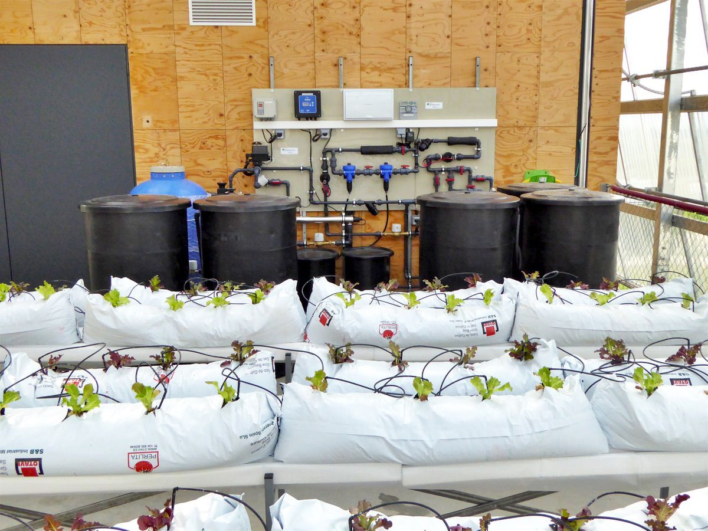

# Sirah alpha

  

## Description

The goal of the SIRAH project is to develop products and technologies from laboratory settings to market scale.
The project is based on 2 products: SIRAH alpha and SIRH beta.
SIRAH is an irrigation module at a prototype level development. The irrigation system has a nutrient and water
recirculation infrastructure installed which can be monitored with an irrigation panel and a sectorization of
water valves.
The potential of the smart irrigation product in the marked will be made in this task. Also, a social impact
assessment is crucial to determine the potential effect on the society of the product installation. The
elaboration of a social study and questionnaire for potential customers and stakeholders will help preventing
possible risks and impacts on the installation of the product. While the increase of vegetation and the creation
of access to fresh produce might signify an improvement, the acceptability to install these production systems
in a person's defined as “NIMBY”.

This repository contains the Sirah Alpha project, which offers the following functionalities:
- XXXX
- XXXX
- XXXX

(<a href="#readme-top">back to top</a>)

## Repository Structure
The repository is organized as follows:
- `docs/`: Contains the project documentation.
- `src/`: Contains the project source code.

(<a href="#readme-top">back to top</a>)

## Installation
To install and run this project, follow these steps:
1. Clone this repository to your local machine.
2. Navigate to the project directory.
3. Execute [necessary installation commands].

## Usage
To use this project, follow these steps:
1. [Instructions for using the project].

## Documentation
- [General documentation](docs/general.md)
- [User manual](docs/user_manual.md)
- [API Reference](docs/api_reference.md)

## Contribution
Contributions are welcome! If you wish to contribute to this project, follow these steps:
1. Fork the repository.
2. Create a branch for your contribution (`git checkout -b feature/new-feature`).
3. Make your changes and commit (`git commit -am 'Add new feature'`).
4. Push the branch (`git push origin feature/new-feature`).
5. Create a pull request on GitHub.

## Credits
This project was developed by GRIC (Group of Reasearch and Innovation in Construction) from UPC (Universitat Politècnica de Catalunya and SOSTENIPRA from UAB [Team name or developer].
This project was funded by MCIN/AEI/10.13039/501100011033 and by the European Union“NextGenerationEU”/PRTR with the reference number PDC2021-121054-C21.

## License
This project is licensed under the [License type]. See the LICENSE.md file for more details.
